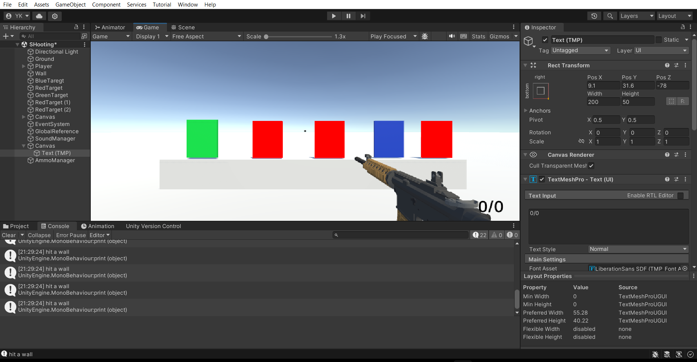

# Readme

This is a readme file describing our project under Electronics club named EMG Shooting game.
In this project we develop a game using unity and use emg sensors connected to our hand to capture the gesture and use the gesture to shoot, reload and aim.

To capture and interpret muscle signals from the player's movements, EMG sensors are placed to detect electrical activity produced by muscle contractions. To refine the signals further, a Butterworth lowpass filter is applied, which smooths out high-frequency noise, making the data cleaner and more accurate.

After filtering, the signals are processed to create an envelope, a smooth curve that outlines the peaks and troughs of the signal, providing a clear representation of muscle activity over time. A threshold is then set to this envelope to distinguish significant muscle movements from minor ones.

Our project incorporates the BNO055 Inertial Measurement Unit (IMU) to enhance the aiming mechanism within the game. The BNO055 combines accelerometer, gyroscope, and magnetometer data to provide highly accurate orientation information. By integrating this advanced sensor, players can experience a more intuitive and precise aiming system, translating real-world movements seamlessly into the game environment.

The integration of refined EMG signals and IMU sensor data enhances the accuracy of gesture detection. Here's how they work together:

•	Synchronization: The EMG and IMU data streams are synchronized to ensure that the analysis considers simultaneous readings from both sources.

•	Correlation Analysis: Algorithms analyze the correlation between muscle activity (from EMG) and wrist movement (from the IMU sensor). This helps in accurately detecting specific gestures like wrist up and wrist down movements.

•	Gesture Recognition: The system recognizes gestures based on predefined patterns in the combined data. When a significant muscle movement is detected, supported by corresponding motion data, the system interprets it as a specific gesture.
This detailed and multi-layered approach ensures precise control in the shooting game, making the gameplay experience intuitive and responsive to the player's wrist movements.

## Installation

Prerequisite: You need to have unity installed in your PC

You will have to install certain python libraries to run this game:

```bash
pip install serial
pip install numpy
pip install scipy
pip install pyqt5 pyqtgraph
pip install Socket
```

## Game


<!--  -->


<!-- ## Usage

```python
import foobar

# returns 'words'
foobar.pluralize('word')

# returns 'geese'
foobar.pluralize('goose')

# returns 'phenomenon'
foobar.singularize('phenomena')
``` -->


## Contributing

Pull requests are welcome. For major changes, please open an issue first
to discuss what you would like to change.

Please make sure to update tests as appropriate.

<!-- ## License

[MIT](https://choosealicense.com/licenses/mit/) -->